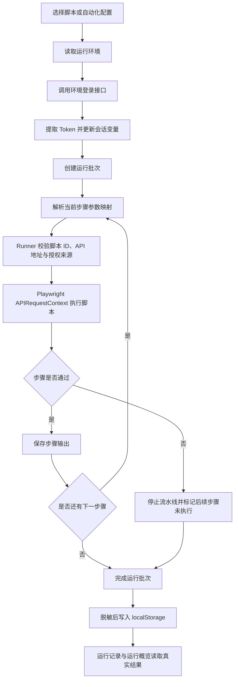

# AutoTest

AutoTest 是一个本地优先的自动化测试管理平台。V0 提供 Vue 3 + Element Plus 管理端、本地 Playwright API Runner、环境登录与 Token 注入、脚本管理、顺序流水线和真实运行记录；当前不依赖数据库。

## 核心功能

- **环境管理**：配置 Web/API 地址、登录接口、手机号验证码或账号密码、业务成功规则、Token 提取路径和自定义变量。
- **脚本管理**：展示本地脚本元数据，支持单脚本和批量手动运行。
- **自动化配置**：按顺序组合多个已注册脚本，可将前序脚本输出映射为后续脚本的运行时变量。
- **运行记录**：按批次保存脚本状态、耗时、日志、输出和数据分析；运行概览只统计真实记录。
- **安全边界**：Runner 只执行注册表内的脚本 ID，校验 API 与授权来源同源，持久化日志和结果前对敏感数据脱敏。

## 技术栈

| 层级 | 技术 |
| --- | --- |
| 管理端 | Vue 3、TypeScript、Vite、Element Plus、Pinia、Vue Router、ECharts |
| 本地 Runner | Node.js 22、原生 HTTP Server |
| 自动化执行 | Playwright `APIRequestContext` |
| 测试 | Vitest、Node Test Runner |
| 本地数据 | `localStorage`、`sessionStorage` |

## 快速开始

### 环境要求

- Node.js `>= 22`
- npm

### 安装与运行

```powershell
git clone https://github.com/caozichen/autoTest.git
cd autoTest
npm.cmd install
npm.cmd run dev
```

启动后访问：

- Web：`http://127.0.0.1:5174`
- Runner 健康检查：`http://127.0.0.1:4310/health`

本地管理端账号为 `admin / admin123`，只用于本机界面访问，不是生产认证方案。

## 使用方法

1. 登录管理端，进入“环境管理”。
2. 编辑预设的测试环境，填写自己的登录手机号与当前验证码；源码不包含登录凭据。
3. 点击“测试登录”，确认业务响应成功，并从 `data.token` 提取 `AUTH_TOKEN`。
4. 在“脚本管理”中选择环境并运行脚本，或进入“自动化配置”创建有序流水线。
5. 在“运行记录”查看批次日志、断言结果和数据分析；“运行概览”同步读取真实记录。

预设测试环境保留以下可编辑规则：

| 配置项 | 默认值 |
| --- | --- |
| Web 地址 | `https://lx.admin.lingxi.tech/` |
| API 地址 | `https://lx.admin.lingxi.tech/api` |
| 登录接口 | `POST /be/login/mobile` |
| 成功规则 | `code = 0` |
| Token 路径 | `data.token` |
| Token 变量 | `AUTH_TOKEN` |

## 核心执行逻辑



流水线只登录一次。步骤参数映射使用 `sourceScriptId + sourcePath -> targetKey`，提取出的字符串、数字或布尔值只在当前批次内生效，不会污染全局 Token。任一步失败或必需路径无法提取时，流水线立即停止。

## 项目结构

```text
autoTest/
├─ apps/
│  ├─ web/                 # Vue 管理端
│  │  └─ src/
│  │     ├─ domain/        # 领域模型
│  │     ├─ services/      # 本地服务接口与实现
│  │     ├─ views/         # 管理页面
│  │     └─ components/    # 业务组件
│  └─ api/                 # 本地 Playwright HTTP Runner
├─ scripts/                # 已注册自动化脚本
├─ package.json            # npm workspaces 与统一命令
└─ README.md
```

## 接入新脚本

V0 的 Runner 不接受任意文件路径。接入脚本需要：

1. 在 `scripts/` 新增模块并导出 `run(context)`。
2. 在 `apps/api/script-runner.mjs` 的 `scriptRegistry` 注册脚本 ID。
3. 在 `apps/web/src/services/scripts/local-script.service.ts` 增加相同 ID 的脚本元数据。
4. 重启 Runner，并执行测试与构建校验。

已包含的真实脚本 `form-contact-publish.api.spec.mjs` 会创建表单草稿、开启联系人收录、发布表单并校验已发布列表。脚本会在目标环境留下创建的数据，不执行自动清理。

## 数据与安全

- 环境、自动化配置和最近 200 条运行记录保存在浏览器 `localStorage`。
- 登录状态、Token 和运行时变量保存在 `sessionStorage`，退出平台时清空。
- Token、Authorization、手机号、验证码、密码及标记为 secret 的变量不会写入运行记录明文。
- Git clone 只迁移代码和已注册脚本，不迁移浏览器本地配置或历史记录。
- 后续接入数据库时，可保留领域模型和服务接口，为认证、环境、脚本、流水线、运行记录与概览提供 HTTP 实现。

## 开发校验

```powershell
npm.cmd test
npm.cmd run typecheck
npm.cmd run build
```

## V0 限制

- 当前真实脚本使用 Playwright `APIRequestContext`，不会启动 Chromium UI。
- 页面新增的脚本元数据仅保存在当前内存，刷新后重置；可执行脚本仍需写入仓库并注册。
- 自动化配置只支持串行执行和失败即停止，暂不支持并行、分支、定时任务或远程执行节点。
- 当前无数据库、用户权限系统和生产级身份认证。
