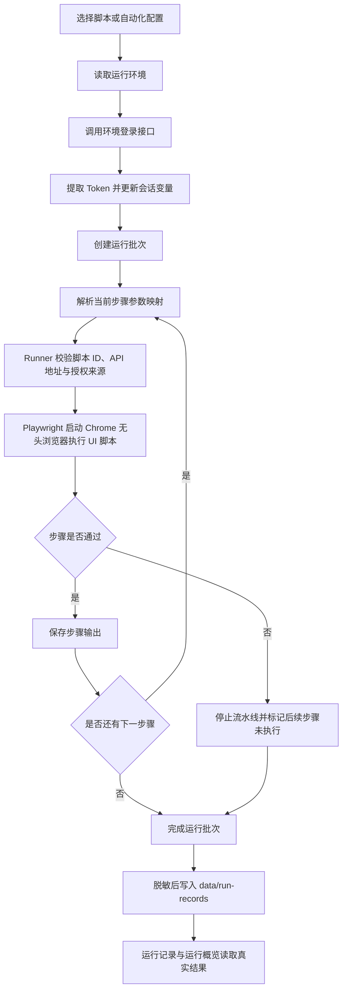

# AutoTest

AutoTest 是一个本地优先的自动化测试管理平台。V0 提供 Vue 3 + Element Plus 管理端、本地 Playwright Runner、环境登录与 Token 注入、脚本管理、顺序流水线和真实运行记录；当前不依赖数据库。

## 核心功能

- **环境管理**：配置 Web/API 地址、登录接口、手机号验证码或账号密码、业务成功规则、Token 提取路径和自定义变量。
- **脚本管理**：展示本地脚本元数据，支持单脚本和批量手动运行。
- **执行控制**：实时刷新运行日志；运行中的脚本可从操作栏强制停止，并将当前任务及同批次后续任务标记为已中断。
- **自动化配置**：按顺序组合多个已注册脚本，可将前序脚本输出映射为后续脚本的运行时变量。
- **运行记录**：按批次保存脚本状态、耗时、日志、输出和数据分析；运行概览只统计真实记录。
- **安全边界**：Runner 只执行持久配置中已启用的脚本 ID，校验入口真实路径及 API 与授权来源同源，持久化日志和结果前对敏感数据脱敏。

## 技术栈

| 层级 | 技术 |
| --- | --- |
| 管理端 | Vue 3、TypeScript、Vite、Element Plus、Pinia、Vue Router、ECharts |
| 本地 Runner | Node.js 22、原生 HTTP Server |
| 自动化执行 | Playwright + Google Chrome 无头模式 |
| 测试 | Vitest、Node Test Runner |
| 本地数据 | JSON 文件、`localStorage`、`sessionStorage` |

## 快速开始

### 环境要求

- Node.js `>= 22`
- npm
- 本机已安装 Google Chrome（内置 UI 脚本使用 `channel: 'chrome'`、`headless: true`）

### 安装与运行

```powershell
git clone https://github.com/caozichen/autoTest.git
cd autoTest
npm.cmd install
npm.cmd run dev
```

`npm.cmd run dev` 会启动本地 Supervisor，由它拉起 Web 和 Runner，并在 Web 退出后自动恢复。前台运行时请保持终端开启。排障时也可以分别启动：

```powershell
# 终端 1：Web
npm.cmd run dev:web

# 终端 2：Runner
npm.cmd run dev:api

# Runner 健康检查
Invoke-RestMethod http://127.0.0.1:4310/health
```

macOS 可一次性安装登录自启的 LaunchAgent。安装后 Supervisor 由系统保活，不需要持续打开终端：

```bash
npm run install:supervisor
```

启动后访问：

- Web：`http://127.0.0.1:5174`
- Runner 健康检查：`http://127.0.0.1:4310/health`
- Supervisor 健康检查：`http://127.0.0.1:4311/health`

本地管理端账号为 `admin / admin123`，只用于本机界面访问，不是生产认证方案。

## 使用方法

1. 登录管理端，进入“环境管理”。
2. 预设测试环境已带默认手机号与验证码；如凭据变化，可通过环境列表的“编辑”操作更新并保存到当前浏览器。
3. 点击“测试登录”，确认业务响应成功，并从 `data.token` 提取 `AUTH_TOKEN`。
4. 在“脚本管理”中选择环境并运行脚本，或进入“自动化配置”创建有序流水线。
5. 在“运行记录”查看批次日志、断言结果和数据分析；“运行概览”同步读取真实记录。
6. Runner 离线时进入“系统设置 / Runner 管理”，点击“启动 Runner”。

### 强制停止

- 脚本运行时，操作栏会显示“强制停止”。确认后 Runner 会发送 `AbortSignal`，内置脚本随即关闭 Playwright context 和 Chrome，结果记为 `interrupted`。
- 批量运行或流水线中强制停止当前脚本时，同批次正在运行的脚本会停止，尚未执行的步骤会跳过。
- 刷新或关闭管理页面不会停止 Runner 中的任务；页面日志会停止刷新，但后台脚本可能继续执行。重新打开页面后应通过脚本操作栏强制停止。
- 如果 Runner 已无活动任务但本地仍显示“执行中”，强制停止会解除本地运行锁并标记为已中断。停止失败时先检查 `/health`，恢复 Runner 后重试。

预设测试环境保留以下可编辑规则：

| 配置项 | 默认值 |
| --- | --- |
| Web 地址 | `https://lx.admin.lingxi.tech/` |
| API 地址 | `https://lx.admin.lingxi.tech/api` |
| 登录接口 | `POST /be/login/mobile` |
| JSON 请求体 | `{"mobile":"13671153204","verify_code":"666666"}` |
| 成功规则 | `code = 0` |
| Token 路径 | `data.token` |
| Token 变量 | `AUTH_TOKEN` |

## 已注册脚本

| 脚本 ID | 入口 | 主要行为 | 前置条件与副作用 |
| --- | --- | --- | --- |
| `form-all-fields-publish` | `scripts/form-all-fields-publish.ui.spec.mjs` | 创建三页全题型表单，配置表单描述与富文本内容、题型限制、三级级联、题组联系人、描述说明和分割线；上传头图、应用推荐配色，并校验草稿保存、发布接口及已发布列表。 | 首次运行会在 `outputs/form-all-fields-publish/fixtures/` 生成跨平台默认头图；也可通过环境变量 `HEADER_IMAGE_PATH` 指定本机图片。会留下真实已发布表单和上传文件。 |
| `form-all-fields-submit` | `scripts/form-all-fields-submit.ui.spec.mjs` | 访问公开表单 `qBM33p`，填写三页题目、上传附件、完成签名、校验分页接口并提交；同时断言后台 Token 未发送到公开表单域名。 | 依赖固定 `FORM_CODE`、标题和 field key 与线上表单一致；会留下真实提交记录。长下拉使用精确 listbox、键盘选择和最多 3 次重试。 |
| `form-lpxavn-submit` | `scripts/form-lpxavn-submit.ui.spec.mjs` | 通过可配置公开表单路径校验发布契约、填写三页全题型字段并提交，支持接收前序发布脚本输出的表单短码与结构契约。 | 会留下真实提交记录；目标表单结构必须符合发布脚本契约。后台 Token 不会注入公开表单域名。 |
| `form-submission-reply-edit` | `scripts/form-submission-reply-edit.ui.spec.mjs` | 从显示“编辑”按钮的提报详情初始态开始，校验详情内容，进入编辑态校验控件，提交后检查精确更新接口、业务结果、详情态恢复和修改值回显。 | 会对目标提报执行真实 `PUT` 保存。默认 ID 为 `lpXAWZ` / `lg2bkk`，URL、断言及简单文本修改值均可在脚本编辑器或流水线中覆盖。 |
| `form-contact-publish` | `scripts/form-contact-publish.ui.spec.mjs` | 创建表单，加入姓名、手机号和邮箱联系人题，设置“忽略，不替换”，保存草稿、发布并校验已发布列表。 | 会留下真实已发布表单，不自动清理。 |

`form-all-fields-publish` 与 `form-all-fields-submit` 当前不会自动串联：填写脚本不会填写刚刚发布的表单。更换目标公开表单时，需要同步更新 `FORM_CODE`、`EXPECTED_FORM_TITLE` 和 `FIELD_KEYS`。失败截图写入 `outputs/<script-id>/`，填写脚本生成的临时上传文件位于对应的 `fixtures/` 目录。

### 提报详情编辑参数

`form-submission-reply-edit` 的默认路径为 `/form-activity/submission/preview/reply/{{SUBMISSION_ID}}?fid={{FORM_ID}}`。脚本编辑器中的输入参数提供默认值，环境变量、运行变量或流水线前序输出的同名映射会在本次运行中覆盖默认值，且不会影响同批次其他脚本。

| 参数 | 默认值 | 用途 |
| --- | --- | --- |
| `SUBMISSION_ID` | `lpXAWZ` | 提报 ID，同时用于详情路径和保存接口。 |
| `FORM_ID` | `lg2bkk` | 表单 ID，同时用于 `fid` 和保存接口。 |
| `SUBMISSION_ASSERTIONS` | `{}` | 详情态与编辑态动态断言；支持 `title`、`status`、`texts`、`fields`、`editFields`。 |
| `SUBMISSION_EDIT_VALUES` | `{}` | 按字段标题填写简单文本控件，例如 `{"姓名[1]":"修改后的姓名"}`。 |

断言参数示例：

```json
{
  "title": "活动提报详情",
  "status": "已提交",
  "texts": ["提報資訊"],
  "fields": { "姓名[1]": "初始姓名" },
  "editFields": { "姓名[1]": "初始姓名" }
}
```

`fields` 和 `editFields` 也可只传字段名数组，此时只检查字段或控件存在。标签重复时使用从 1 开始的序号，例如 `姓名[1]` 表示第一个“姓名”，`姓名[2]` 表示第二个；裸标签仍要求全页唯一，避免误改。保持两个 JSON 参数为 `{}` 时，脚本仍会执行初始详情态、编辑态和提交成功的结构检查，并点击提交。

## 核心执行逻辑



流水线只登录一次。步骤参数映射使用 `sourceScriptId + sourcePath -> targetKey`，提取出的字符串、数字或布尔值只在当前批次内生效，不会污染全局 Token。任一步失败或必需路径无法提取时，流水线立即停止。

## 项目结构

```text
autoTest/
├─ apps/
│  ├─ web/                 # Vue 管理端
│  │  └─ src/
│  │     ├─ domain/        # 领域模型
│  │     ├─ services/      # 本地服务接口与实现
│  │     ├─ views/         # 管理页面
│  │     └─ components/    # 业务组件
│  └─ api/                 # 本地 Playwright HTTP Runner
├─ config/
│  └─ scripts/             # 按脚本拆分的持久化 JSON 配置
├─ data/
│  └─ run-records/         # 按批次拆分的本地运行记录
├─ scripts/                # 自动化脚本与本地 Supervisor
├─ package.json            # npm workspaces 与统一命令
└─ README.md
```

## 接入新脚本

Runner 不接受运行请求传入任意文件路径。接入脚本需要：

1. 在 `scripts/` 新增模块并导出 `run(context)`；长任务必须检查 `context.signal`，并通过 `playwright-run-control.mjs` 注册 abort 清理，保证强制停止能及时关闭浏览器。
2. 在脚本管理页面新增配置，或在 `config/scripts/` 新增对应的版本化 JSON 文件；入口只允许使用项目 `scripts/` 目录内真实存在的 `.mjs` 文件。
3. 重启 Runner，并执行测试与构建校验。通过页面创建或修改的配置会立即原子写入 `config/scripts/`，无需维护第二份静态注册表。

内置脚本的行为、依赖和副作用见“已注册脚本”。

## 数据与安全

- 环境和自动化配置保存在浏览器 `localStorage`。
- 脚本配置以一脚本一文件的方式保存在 `config/scripts/`，应随 Git 提交；运行记录保存在 `data/run-records/`，不会因清理浏览器数据而删除。
- 登录状态、Token 和运行时变量保存在 `sessionStorage`，退出平台时清空。
- Token、Authorization、手机号、验证码、密码及标记为 secret 的变量不会写入运行记录明文。
- Git clone 会迁移代码和 `config/scripts/` 中已提交的脚本配置，不迁移浏览器本地配置或被 `.gitignore` 排除的运行历史。
- 脚本配置通过 Repository 接口访问；后续可将文件仓储替换为 MySQL 实现，而不改变 Web API 和 Runner 执行协议。

## 开发校验

```powershell
npm.cmd test
npm.cmd run typecheck
npm.cmd run build
```

## V0 限制

- 当前真实脚本依赖本机已安装 Google Chrome；以 `headless: true` 启动，不显示浏览器窗口。
- 全题型填写脚本仍依赖固定公开表单结构；发布与填写脚本尚未通过流水线输出自动衔接。
- 实际脚本代码仍需写入项目 `scripts/` 目录；脚本管理页面只负责持久化配置，不在线创建或修改 `.mjs` 源码。
- 自动化配置只支持串行执行和失败即停止，暂不支持并行、分支、定时任务或远程执行节点。
- 当前无数据库、用户权限系统和生产级身份认证。
