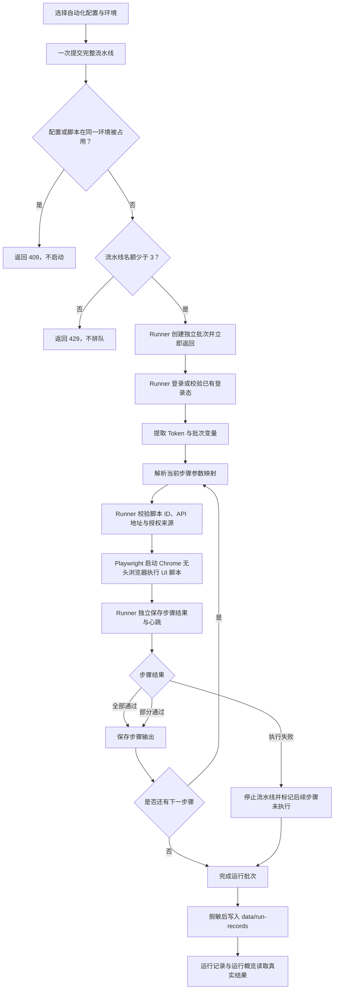

# AutoTest

AutoTest 是一个本地优先的自动化测试管理平台。v1.1 提供 Vue 3 + Element Plus 管理端、本地 Playwright Runner、环境登录与 Token 注入、脚本管理、跨环境并发流水线和真实运行记录；当前不依赖数据库。单个 Runner 最多同时执行三个流水线批次，每个批次内部按顺序运行。

## v1.1 更新（2026-09）

- **三环境脚本适配**：测试、内地生产、香港生产均已有六步骤完整批次通过记录；新增内地版创建表单入口，其他步骤共用环境感知实现，公开域名统一解析。
- **脚本清单更新**：当前注册 7 个脚本，新增“创建完整表单（内地版）”“检查提报列表”“手动创建提报信息”；下线旧联系人表单发布和独立提报编辑配置。
- **自动化配置优化**：配置与固定环境解绑，运行前统一选择本次环境；支持步骤排序及同批次输出映射。三环境六步骤配置方法见下文。
- **环境与登录优化**：支持按环境复用已有登录态、管理 Token 和到期时间；香港环境的执行和操作超时统一按标准值乘以 3。
- **运行记录优化**：脚本结果明确展示“执行成功 / 部分通过 / 执行失败 / 未执行”；环境 Tab 与搜索、状态筛选联动，系统设置提供独立 Tab 选择、排序和预览页面。
- **执行稳定性**：统一页面就绪与单次点击等待，增强题目、提报、接口和资源断言；AI 翻译标准等待 10 分钟、脚本总超时 15 分钟。
- **失联恢复第一阶段**：Runner 独立维护心跳并保存脚本结束结果，保存失败只重试写入；无任务且超过宽限期后补写批次终态或标记中断，不自动重跑业务操作。
- **后台流水线第二阶段**：Runner 接管整批登录、顺序调度、参数提取、停止和结果保存；刷新或关闭页面后继续后续步骤，重新打开可查看与停止。
- **自动化并发（2026-09-11）**：最多三个批次同时执行，不同环境可共用配置和脚本；环境、Token、变量、日志和制品按批次隔离。新增后台批次面板、指定批次停止和按环境查看日志，完整回归 599 项通过，三个真实环境并发各六步通过。详见[并发回归记录](docs/concurrency-regression-2026-09-11.md)。

## 核心功能

- **环境管理**：配置 Web/API 地址、登录接口、手机号验证码或账号密码、业务成功规则、Token 提取路径和自定义变量。
- **脚本管理**：展示本地脚本元数据，支持单脚本和批量手动运行。
- **执行控制**：实时刷新运行日志；可从脚本操作栏或运行记录直接强制停止，并将当前任务及同批次后续任务标记为已中断。
- **自动化配置**：按顺序组合多个已注册脚本，将前序输出映射为后续步骤变量；支持跨环境同时运行，并在后台批次面板分别查看和停止。
- **运行记录**：按批次保存脚本状态、耗时、日志、输出和数据分析；运行概览只统计真实记录。
- **安全边界**：Runner 只执行持久配置中已启用的脚本 ID，校验入口真实路径及 API 与授权来源同源，持久化日志和结果前对敏感数据脱敏。

## 技术栈

| 层级 | 技术 |
| --- | --- |
| 管理端 | Vue 3、TypeScript、Vite、Element Plus、Pinia、Vue Router、ECharts |
| 本地 Runner | Node.js 22、原生 HTTP Server |
| 自动化执行 | Playwright + Google Chrome 无头模式 |
| 测试 | Vitest、Node Test Runner |
| 本地数据 | JSON 文件、`localStorage`、`sessionStorage` |

## 快速开始

### 环境要求

- Node.js `>= 22`
- npm
- 本机已安装 Google Chrome（内置 UI 脚本使用 `channel: 'chrome'`、`headless: true`）

### 安装与运行

```powershell
git clone https://github.com/caozichen/autoTest.git
cd autoTest
npm.cmd install
npm.cmd run dev
```

`npm.cmd run dev` 会启动本地 Supervisor，由它拉起 Web 和 Runner，并在 Web 退出后自动恢复。前台运行时请保持终端开启。排障时也可以分别启动：

```powershell
# 终端 1：Web
npm.cmd run dev:web

# 终端 2：Runner
npm.cmd run dev:api

# Runner 健康检查
Invoke-RestMethod http://127.0.0.1:4310/health
```

macOS 可一次性安装登录自启的 LaunchAgent。安装后 Supervisor 由系统保活，不需要持续打开终端：

```bash
npm run install:supervisor
```

启动后访问：

- Web：`http://127.0.0.1:5174`
- Runner 健康检查：`http://127.0.0.1:4310/health`
- Supervisor 健康检查：`http://127.0.0.1:4311/health`

本地管理端账号为 `admin / admin123`，只用于本机界面访问，不是生产认证方案。

## 使用方法

1. 登录管理端，进入“环境管理”。
2. 预设测试环境已带默认手机号与验证码；如凭据变化，可通过环境列表的“编辑”操作更新并保存到当前浏览器。
3. 点击“测试登录”，确认业务响应成功，并从 `data.token` 提取 `AUTH_TOKEN`。
4. 在“脚本管理”中选择环境并运行脚本，或进入“自动化配置”创建有序流水线。
5. 在“运行记录”按环境 Tab 查看批次日志、断言结果和数据分析；进入“系统设置 → 运行记录 Tab 配置”选择显示的环境并调整顺序。
6. Runner 离线时进入“系统设置 / Runner 管理”，点击“启动 Runner”。

### 复用已有登录态（可选）

现有环境默认仍在每次运行前调用登录接口。需要复用登录态时：

1. 在“环境管理 → 编辑 → 登录与 Token”中，将“认证方式”改为“复用已有登录态”，保存环境。
2. 在目标网站手动完成一次登录；从开发者工具 Application → Local Storage 中复制该网站的 `token` 值，或从成功的后台请求中复制 `Authorization` 请求头的值。
3. 回到环境列表点击钥匙图标“管理登录态”，粘贴 Token（支持带 `Bearer` 等前缀）、填写可选账号备注和失效时间，保存。
4. 按原方式运行单脚本、批量脚本或流水线；运行前会加载保存的 Token，跳过登录接口。业务脚本仍使用独立的无头 Chrome。

登录态按环境 ID、Web 地址及 API 地址绑定，改变地址后需重新导入；同一环境更新 Token 即切换到新账号。已知过期的登录态会在执行前拦截；不能从 Token 得知的失效或撤销以业务服务响应为准。如出现未登录或 HTTP 401，请手动重新登录并更新 Token，不会自动退回验证码登录。账号密码、验证码登录配置保留，切回“调用登录接口”即可恢复原流程。

Token 单独保存在当前浏览器 localStorage 中（非加密存储），运行日志按敏感变量脱敏。可在“管理登录态”清除；清除不影响已启动的任务。此方式不会自动读取或接管现有 Chrome 标签页，目前适用于已有脚本使用的 Token 认证，不导入 Cookie 会话。

### 强制停止

- 脚本运行时，操作栏会显示“强制停止”。确认后 Runner 会发送 `AbortSignal`，内置脚本随即关闭 Playwright context 和 Chrome，结果记为 `interrupted`。
- 批量运行或流水线中强制停止当前脚本时，同批次正在运行的脚本会停止，尚未执行的步骤会跳过。
- 多个环境共用一个脚本时，脚本管理会先要求选择要停止的批次；自动化配置页的“停止此批次”直接定位目标。停止一个批次不影响其他批次，停止后不自动续跑。
- “自动化配置”整条流水线由 Runner 执行，接收成功后刷新或关闭管理页面仍会执行后续步骤并保存结果。重新打开“自动化配置”或“运行记录”可查看状态、强制停止；脚本管理中的普通单次/批量运行沿用原有执行方式。
- 如果 Runner 已无活动任务但记录仍显示“执行中”，系统会按下文的失联规则自动校正；也可手动强制停止解除运行锁。停止失败时先检查 `/health`，恢复 Runner 后重试。

预设测试环境保留以下可编辑规则：

| 配置项 | 默认值 |
| --- | --- |
| Web 地址 | `https://lx.admin.lingxi.tech/` |
| API 地址 | `https://lx.admin.lingxi.tech/api` |
| 登录接口 | `POST /be/login/mobile` |
| JSON 请求体 | `{"mobile":"13671153204","verify_code":"666666"}` |
| 成功规则 | `code = 0` |
| Token 路径 | `data.token` |
| Token 变量 | `AUTH_TOKEN` |

## 已注册脚本

注册清单以 `config/scripts/*.json` 为准，当前共 7 个。每次完整环境回归使用其中 6 个，创建表单步骤根据环境二选一。

| 脚本 ID | 当前名称 | 入口（均位于 `scripts/`） | 行为与前置条件 |
| --- | --- | --- | --- |
| `form-all-fields-publish` | 创建完整表单 | `form-all-fields-publish.ui.spec.mjs` | 测试、香港环境创建三页全题型表单，配置必填、限制、级联、题组联系人、头图与配色，保存发布并校验列表；输出 `formId`、`formContract`。 |
| `form-all-fields-publish-mainland` | 创建完整表单（内地版） | `form-all-fields-publish-mainland.ui.spec.mjs` | 适配内地直接添加联系人、缺少首次收录弹窗和全局菜单的流程，共用全题型创建与输出契约。 |
| `form-lpxavn-submit` | 填写指定表单 | `form-lpxavn-submit.ui.spec.mjs` | 使用动态 `FORM_ID` 与 `FORM_CONTRACT`，填写三页表单、上传附件、完成签名并提交，校验边界、跨页答案和动态载荷；输出 `formId`、`submissionId`、`submissionAssertions`。 |
| `form-submission-list-check` | 检查提报列表 | `form-submission-list-check.ui.spec.mjs` | 使用本次填写输出定位后台提报，检查详情、全部基础及检索字段、模糊搜索、联系人、顶部名称和标签；同时校验业务接口与站内资源。 |
| `form-all-fields-submit` | 检查并编辑提报信息 | `form-all-fields-submit.ui.spec.mjs` | 当前入口实际复用动态公开表单填写实现，必须提供 `FORM_ID`，建议同时提供 `FORM_CONTRACT`；会新增提交记录。页面名称沿用当前配置，不能将此步骤视作后台编辑已有提报的验证。 |
| `form-submission-reply-create` | 手动创建提报信息 | `form-submission-reply-create.ui.spec.mjs` | 在后台加载动态表单，检查创建态、空表必填与格式边界，填写全部题型，验证唯一创建请求、载荷、详情跳转及回显；输出 `submissionId`。 |
| `form-multilingual-translation-publish` | 设置校验表单多语言翻译 | `form-multilingual-translation-publish.ui.spec.mjs` | 为简体中文原文启用繁体中文与 English，执行 AI 翻译、保存回读、完成发布、分享及公开页三语言校验；标准 AI 等待 10 分钟、总超时 15 分钟。 |

创建脚本默认生成本地头图 fixture，也可通过 `HEADER_IMAGE_PATH` 指定图片。创建、填写、手动提报及发布会留下真实业务数据，不自动清理；提交结果不确定时不自动重复提交。公开表单步骤不会向公开域名注入后台 Token。

`form-contact-publish` 和 `form-submission-reply-edit` 已移除注册配置，不再出现在可运行脚本清单。其历史实现和回归测试保留在代码库中；它们不是当前六步骤自动化配置的组成部分。

内地版按实际页面状态等待姓名、手机号、邮箱生成，不依赖首次“是否收录联系人”弹窗。基础设置加载完成后，若没有全局收录入口，不配置该版本未提供的“忽略，不替换”策略；如果后续部署出现该入口，则仍使用原脚本的设置流程。

其余五个脚本共用原入口，公开表单域名由 `shared/form-environment.mjs` 统一解析；平台请求地址预览、公开填写、多语言预览和 Runner 一方接口归类使用同一规则：

| 环境 | Web 基址示例 | 公开表单域名 |
| --- | --- | --- |
| 内地生产 | `https://prodtest.admin.lingxi360.com` | `https://prodtest.form.lingxi360.com` |
| 香港生产 | `https://prodtest.admin.lxi.hk` | `https://prodtest.lxi.hk` |
| 测试 | `https://lx.admin.lingxi.tech` | `https://lx.lingxi.tech` |

后台创建、列表及翻译编辑继续使用所选环境的管理端域名。内地公开配置仍包含开启收录和忽略冲突策略，因此保留共享契约的严格检查；界面没有全局菜单不会导致跳过题组联系人校验。发布后若出现“产品使用引导”，创建脚本会关闭引导再查询本次表单。

多语言结构和原文比较按 `item_key` 对应题目，允许后台与公开接口的数组排列不同；实际题序 `sort`、题组归属、规则、选项顺序和内容仍严格比较。手动创建使用同一次 DOM 快照检查按钮禁用或消失，避免详情跳转期间分步读取已移除按钮导致误报。

AI 翻译等待参数 `AI_TRANSLATION_TIMEOUT_MS` 默认配置为 600000（10 分钟），整个多语言脚本为 900000（15 分钟）；香港环境继续应用环境超时倍率。实际服务曾耗时超过 6 分钟，脚本仍要求 AI 任务明确成功、译文完整并通过质量检查后才保存发布；超时会保留失败记录，不自动重复提交 AI 任务。

`form-all-fields-submit` 的生产入口复用动态契约填写实现，不再保留固定 `qBM33p`、固定标题或固定 field key 的旧执行路径。要填写刚刚发布的表单，请在自动化配置中将 `form-all-fields-publish` 或 `form-all-fields-publish-mainland` 放在前一步，并显式建立以下参数映射：

| 来源输出路径 | 目标运行变量 | 用途 |
| --- | --- | --- |
| `formId` | `FORM_ID` | 解析配置中的 `/form/?id={{FORM_ID}}`，确定本次公开表单地址。 |
| `formContract` | `FORM_CONTRACT` | 校验前序发布结果，并按动态 field key 填写同一份表单。 |

这两个脚本不会在独立运行时自行配对；串联关系由自动化配置显式定义。对于两个全题型填写入口，Runner 统一将失败截图和上传 fixture 写入 `outputs/artifacts/<executionId>/<stepId>/<attemptId>/`，其中 `stepId` 使用实际注册脚本 ID；fixture 位于该 attempt 目录下的 `fixtures/`。委托共享实现不会改变制品目录或日志中的脚本名称。若 `executionId` 对应已有运行记录，Runner 会在返回最终执行结果前将制品描述合并到对应脚本记录，页面刷新或断开不会丢失已经落盘的制品索引。

“填写指定表单”和动态全题型填写入口完成后都会输出 `formId`、`submissionId` 和 `submissionAssertions`。最后一项包含 `title`、`primaryContactName`、`groupContactName` 以及兼容提报详情断言的 `fields`（`姓名[1]` / `姓名[2]`）；它只用于准确关联本次提交、核对顶部名称和两个联系人，不输出手机号、邮箱、证件号或完整提交载荷。

多语言脚本同样支持动态表单 ID。将任一前序发布脚本的输出路径 `formId` 映射到目标运行变量 `FORM_ID` 后，流水线会覆盖脚本配置中的默认值，并解析 `/form-activity/translation?id={{FORM_ID}}`。变量映射只读取同一次批次中的前序输出，不会读取其它历史批次。

### 手动创建提报参数

`form-submission-reply-create` 的默认路径为 `/form-activity/submission/preview/reply/create?fid={{FORM_ID}}`。独立运行时使用配置中的 `q3r72J`；流水线运行时可把前序发布脚本的 `formId` 映射到 `FORM_ID`，并把 `formContract` 映射到 `FORM_CONTRACT`。脚本完成后输出 `submissionId`，可继续映射为后续步骤的 `SUBMISSION_ID`。

| 参数 | 默认值 | 用途 |
| --- | --- | --- |
| `FORM_ID` | `q3r72J` | 表单 ID，同时用于创建页的 `fid`、表单详情接口和创建接口。 |
| `FORM_CONTRACT` | 空 | 可选的前序发布契约，用于校验动态标题、revision、item key、题目规则和创建载荷。 |

该脚本要求后台 Token，且只向所选环境的同源 API 发送授权信息。它会验证所有后台业务请求均携带 Token，监控接口和静态资源失败，并在真正创建前强制确认空表校验没有误发 POST。最终创建按钮只点击一次；若响应丢失、超时或业务失败，脚本保留失败结果并停止，不会重试以避免产生重复提报。

### 提报列表检查参数

`form-submission-list-check` 的默认路径为 `/form-activity/submission/preview?id={{FORM_ID}}`。要检查刚刚由“填写指定表单”产生的记录，请把该填写步骤放在前面并建立以下参数映射：

| 来源输出路径 | 目标运行变量 | 用途 |
| --- | --- | --- |
| `formId` | `FORM_ID` | 打开本次提交所属表单的后台提报页面。 |
| `submissionId` | `SUBMISSION_ID` | 在列表或详情链接中唯一定位本次提报。 |
| `submissionAssertions` | `SUBMISSION_ASSERTIONS` | 以 `title` 核对顶部名称，以 `primaryContactName` 和 `groupContactName` 核对提报列表及两个联系人。 |

独立运行时默认值为 `4J02PQ`、`vyY5Z5` 和 `{}`，仅用于打开用户提供的示例页面；历史提报可能过期或不属于当前表单，正式回归不应依赖这些默认值。该脚本使用管理端域名和登录 Token，文字定位支持简体中文、繁体中文及英文候选，并将单项等待限制在可控范围内，避免因某一种语言文案不存在而耗尽整批超时。

基础字段和检索字段按当前页面的完整集合动态读取，新增备注、渠道等字段不会触发固定数量错误。文本筛选使用中间片段；可搜索下拉控件先校验中间片段能匹配目标选项，再确认选项并查询。目标记录字段为空时执行排除检查，并记录无法验证正向模糊命中的覆盖限制。详情页图片最多等待 10 秒完成加载和解码后再返回列表，超时仍记录失败。

## 三环境自动化配置

自动化配置不再绑定固定环境。在页面上方选择本次运行环境，所有步骤使用同一环境和登录态。
已有的测试、内地和香港配置可以分别命名为“测试表单冒烟测试”“内地表单冒烟测试”“香港表单冒烟测试”。
这些名称是本地配置示例，不是克隆仓库后自动创建的内置数据。

| 环境 | 创建表单步骤 | 后续共用步骤 |
| --- | --- | --- |
| 测试（`TEST`） | `form-all-fields-publish` | 填写指定表单 → 检查提报列表 → 检查并编辑提报信息 → 手动创建提报信息 → 设置校验表单多语言翻译 |
| 内地生产（`CN_PROD`） | `form-all-fields-publish-mainland` | 同上 |
| 香港生产（`HK_PROD`） | `form-all-fields-publish` | 同上；也可将多语言翻译放在创建之后，再执行填写和提报检查 |

2026-09-11 的实际并发验收使用“测试表单冒烟测试”“内地表单冒烟测试”“香港表单冒烟测试”，三个环境各六步全部通过，共 46,205 条断言，失败 0；三个批次同时运行的时间重叠约 624 秒。验收记录对应当时配置和业务版本，后续运行仍以实际断言、网络和 AI 服务结果为准。

在“自动化配置 → 新增”选择并排序脚本后，配置以下映射。其中“创建步骤”按上表选择实际脚本 ID，“填写步骤”指 `form-lpxavn-submit`。

| 目标步骤 | 来源步骤及输出 | 目标变量 |
| --- | --- | --- |
| 填写指定表单 | 创建步骤：`formId`、`formContract` | `FORM_ID`、`FORM_CONTRACT` |
| 检查提报列表 | 填写步骤：`formId`、`submissionId`、`submissionAssertions` | `FORM_ID`、`SUBMISSION_ID`、`SUBMISSION_ASSERTIONS` |
| 检查并编辑提报信息（当前动态填写入口） | 创建步骤：`formId`、`formContract` | `FORM_ID`、`FORM_CONTRACT` |
| 手动创建提报信息 | 创建步骤：`formId`、`formContract` | `FORM_ID`、`FORM_CONTRACT` |
| 设置校验表单多语言翻译 | 创建步骤：`formId` | `FORM_ID` |

每个来源只能选当前步骤之前的脚本，调整顺序后需检查映射。内地配置切换创建脚本时，也需把映射来源改为 `form-all-fields-publish-mainland`。
运行前检查脚本是否启用、环境是否可用以及登录态是否有效。浏览器中的配置、环境和 Tab 偏好不会随 Git 提交迁移；新电脑需按这些步骤重新配置。

### 同时运行三个环境

在“自动化配置”页依次选择环境并启动对应配置，无需等待上一个批次结束：

| 选择的环境 | 启动的配置 |
| --- | --- |
| 内地生产环境 · `CN_PROD` | 内地表单冒烟测试 |
| 香港生产环境 · `HK_PROD` | 香港表单冒烟测试 |
| 测试环境 · `TEST` | 测试表单冒烟测试 |

“后台运行批次”面板显示每个批次的环境、当前步骤及停止按钮。配置行的“当前环境状态”对应顶部选中的环境；切换环境只影响之后的启动，已接收的批次继续使用自己的环境快照和登录态。脚本管理中的日志可按环境选择，打开后固定查看所选批次；全部历史结果在“运行记录”中查看。

- 不同环境可同时使用同一个配置或脚本，但创建步骤仍需按上表适配环境。同一环境内，相同配置或含有相同脚本的批次互斥；指向相同 API origin 的环境别名也按同一环境处理。
- 同时最多占用三个流水线名额，登录中、执行中、等待保存及重启后待恢复的批次均计入。第四个启动请求返回 429，不自动排队；待一个批次结束后再手动启动。
- 刷新或关闭管理页面后，Runner 继续调度；重新打开页面可恢复批次状态。Runner 进程退出后按失联恢复规则处理记录，不自动重跑业务操作。
- 一个批次失败或停止不会取消其他批次。每个批次内部的步骤仍按顺序执行，部分通过继续，执行失败、超时或必需输出缺失则停止后续步骤。

## 运行记录与环境 Tab

- 列表脚本结果分别展示执行成功、部分通过、执行失败和未执行数量，执行中每秒刷新；顶部统计按当前环境汇总运行批次。
- 列表顶部固定保留“全部环境”。首次默认展示已有环境，在“系统设置 → 运行记录 Tab 配置”可添加、移除、上移/下移、预览并保存 Tab。
- 环境 Tab 与搜索、状态筛选和分页联动；原环境下拉框仍可访问未设为 Tab 的环境。移除 Tab 不删除环境或历史记录。
- 详情请求慢或失败不会阻塞列表刷新；详情包含步骤日志、断言、接口证据和截图。

### 心跳与失联恢复

Runner 每 10 秒独立维护执行心跳，在脚本结束时直接保存脱敏后的结果、日志、断言、输出和制品。
临时写入失败只重试保存，不重复执行业务脚本。任务仍在 Runner 中执行时，即使 AI 翻译长时间没有新日志，也不会因失联检查而被停止或标记中断。

当 Runner 重启或已无活动任务，系统保留 2 分钟恢复宽限期：
全部步骤都有结果则补写成功、部分通过或失败终态；仍有未确认步骤则标记中断，保留已完成结果并提示人工核对业务数据。
Runner 接管的流水线在登录阶段也适用 2 分钟宽限期；旧版前端创建、尚未登记 Runner 任务的登录记录继续使用 4 小时兜底。

整条流水线由 Runner 负责：浏览器一次提交本批次的环境、登录态及有序步骤，随后只查询状态。Runner 登录一次，在内存中维护当前批次变量，逐步保存结果，并持续提供实时日志与计数。相同执行 ID 重复提交不会再次执行；并发批次各自持有环境快照、Token、变量、步骤输出、浏览器和制品目录。普通单脚本/批量入口保留原流程。

Runner 进程退出后不自动恢复执行业务步骤，只恢复运行记录状态。登录凭据、Token 和原始执行参数不会作为任务载荷写入磁盘；如步骤结果保存失败，保留内存结果重试保存并停止后续步骤，避免丢失执行凭据后继续操作。
对结果未知的创建或发布操作，先核对业务数据，再决定是否手动重试。

## 核心执行逻辑



流水线只登录一次。步骤参数映射使用 `sourceScriptId + sourcePath -> targetKey`，提取出的字符串、数字、布尔值及 JSON 对象只在当前批次内生效，不会污染全局 Token。断言未全部通过但脚本已正常完成时记录为“部分通过”，保存输出并继续后续步骤；执行失败或必需路径无法提取时，流水线立即停止。

## 项目结构

```text
autoTest/
├─ apps/
│  ├─ web/                 # Vue 管理端
│  │  └─ src/
│  │     ├─ domain/        # 领域模型
│  │     ├─ services/      # 本地服务接口与实现
│  │     ├─ views/         # 管理页面
│  │     └─ components/    # 业务组件
│  └─ api/                 # 本地 Playwright HTTP Runner
├─ config/
│  └─ scripts/             # 按脚本拆分的持久化 JSON 配置
├─ data/
│  └─ run-records/         # 按批次拆分的本地运行记录
├─ scripts/                # 自动化脚本与本地 Supervisor
├─ package.json            # npm workspaces 与统一命令
└─ README.md
```

## 接入新脚本

Runner 不接受运行请求传入任意文件路径。接入脚本需要：

1. 在 `scripts/` 新增模块并导出 `run(context)`；长任务必须检查 `context.signal`，并通过 `playwright-run-control.mjs` 注册 abort 清理，保证强制停止能及时关闭浏览器。
2. 在脚本管理页面新增配置，或在 `config/scripts/` 新增对应的版本化 JSON 文件；入口只允许使用项目 `scripts/` 目录内真实存在的 `.mjs` 文件。
3. 重启 Runner，并执行测试与构建校验。通过页面创建或修改的配置会立即原子写入 `config/scripts/`，无需维护第二份静态注册表。

内置脚本的行为、依赖和副作用见“已注册脚本”。

## 数据与安全

- 环境和自动化配置保存在浏览器 `localStorage`。
- 脚本配置以一脚本一文件的方式保存在 `config/scripts/`，应随 Git 提交；运行记录保存在 `data/run-records/`，不会因清理浏览器数据而删除。
- 平台登录会话及运行时变量使用 `sessionStorage`；环境配置和手动导入的复用 Token 存于当前浏览器 `localStorage`。退出平台会清理运行时变量，已导入的登录态需在环境管理中单独清除。
- Token、Authorization、手机号、验证码、密码及标记为 secret 的变量不会写入运行记录明文。
- Git clone 会迁移代码和 `config/scripts/` 中已提交的脚本配置，不迁移浏览器本地配置或被 `.gitignore` 排除的运行历史。
- 脚本配置通过 Repository 接口访问；后续可将文件仓储替换为 MySQL 实现，而不改变 Web API 和 Runner 执行协议。

## 开发校验

```powershell
npm.cmd test
npm.cmd run typecheck
npm.cmd run build
```

自动化回归使用本地 HTTP fixture、模拟执行器或被拦截的测试页面，不会运行真实业务环境流水线。包含 Chrome 刷新、关闭、重新打开后继续执行与停止的端到端验证，以及三环境地址与超时兼容性回归。macOS 下必须允许已安装的 Google Chrome 在沙箱外运行；不得关闭 `google-chrome.mjs` 的检查。

2026-09-11 并发改造的完整校验结果：

| 校验 | 结果 |
| --- | --- |
| 前端 Vitest | 262 项通过 |
| 后端、脚本及 Google Chrome 回归 | 337 项通过，失败及跳过均为 0 |
| 类型、语法检查与生产构建 | 通过；构建保留已有 bundle 体积提示 |
| 通过管理页面另行启动的三环境并发验收 | 每个环境 6/6 步通过，46,205 条断言全部通过 |

完整结果、批次 ID、首轮问题修复及“检查并编辑提报信息”的实际覆盖范围见[并发回归记录](docs/concurrency-regression-2026-09-11.md)。完整原始日志、运行 JSON 和截图保留在本地 `outputs/concurrency-20260911/`、`data/run-records/` 及 `outputs/artifacts/`，这些目录不随 Git 提交。

## 当前限制

- 当前真实脚本依赖本机已安装 Google Chrome；以 `headless: true` 启动，不显示浏览器窗口。
- 流水线变量映射只支持同一批次的前序脚本输出，暂不支持读取其它历史批次的输出。
- 实际脚本代码仍需写入项目 `scripts/` 目录；脚本管理页面只负责持久化配置，不在线创建或修改 `.mjs` 源码。
- 单个 Runner 支持最多三个流水线批次并发；批次内部暂不支持步骤并行、分支或失败后续跑，也未提供定时调度、远程执行节点和自动排队。部分通过会继续后续步骤。
- 文件存储按单 Runner 进程设计，不能用多个 Runner 共享同一数据目录来扩大并发；需要多进程或多机器调度时应增加协调机制与数据库仓储。
- 运行记录与首页概览当前通过 Runner 的本地 HTTP 接口读取磁盘数据；Runner 离线时历史数据暂时无法加载，需要先由 Supervisor 恢复 Runner。
- 当前无数据库、用户权限系统和生产级身份认证。

### 香港环境超时倍率

脚本配置中的超时时间保留为标准值。运行环境标识包含 `hk`（不区分大小写）时，脚本总超时以及各脚本的点击、弹窗、导航、断言、接口读取、AI 翻译和清理等待上限均按标准值乘以 3。其余环境保持标准值。倍率按每次运行隔离计算，不改变轮询频率或重试次数，也不会在传递剩余等待时间时重复放大。

### 页面加载与点击等待

当前七个已注册脚本的点击统一经过 `scripts/support/ui-readiness.mjs`（动态表单填写入口复用同一实现）。在导航前注册业务请求观察，点击前等待有限业务请求正文结束、可见加载状态消失，并为请求完成和上一次交互后的异步更新保留 200ms 静默窗口。目标控件完成可操作性预检后再次确认加载状态，最终只发送一次实际点击。图片、字体和后台 AI 状态轮询不作为全页点击前置条件；原有具体控件、弹窗和业务结果检查仍保留。

加载等待与实际点击共享原有单次操作预算，香港环境倍率只应用一次。加载始终不结束时会明确报出待完成的业务接口路径和加载状态，不会无限等待或自动重试创建、保存、发布。多语言 GET 响应监听要求正文可读取，工作区导航回读只接受新文档发出的请求，避免旧页面或未完成的重复响应抢先匹配。

创建空白表单后，先确认设计器题型库已加载；仅在页面明确提示加载失败、且尚未编辑题目时，允许在同一导航预算内重载当前表单一次，不重复创建。持续加载失败会明确终止。排序题点击具体选项文字并确认排名生效后才继续填写；公开填写、动态入口和后台手动创建共用该逻辑。

普通展示断言失败仍记录为“部分通过”并继续后续检查；只有缺失实际操作所需控件、关键填写结果未生效或业务请求失败等情况才阻断。提报列表网络汇总只统计当前后台 API 和站内资源，第三方遥测保留日志但不误算成业务接口失败。

公开全题型填写在完成第一页空表校验后，会等待当前页面已发出的接口正文和图片等资源加载完成，再主动刷新以清除校验状态。等待使用当前环境的导航预算；超时会终止刷新及后续提报，网络失败证据继续保留。这样避免并发或慢网络时提前刷新中断旧文档请求，造成收尾误报。
