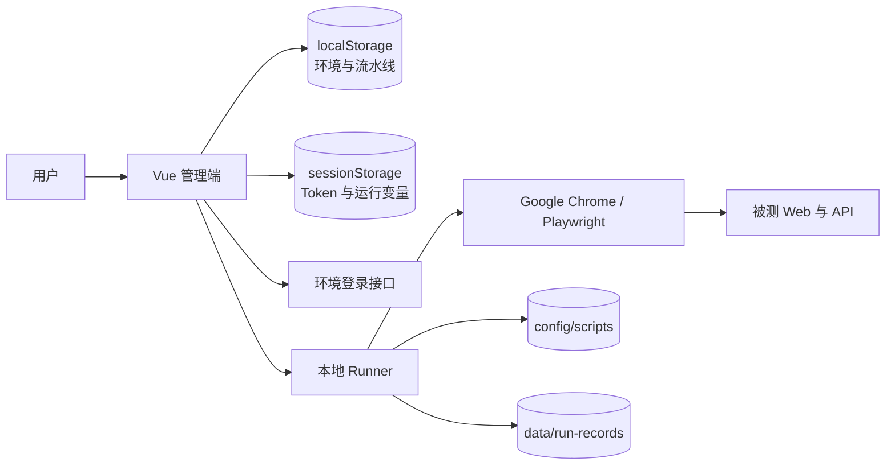

# AutoTest 冒烟测试平台现状评估与演进建议

> 评估日期：2026-08-31
>
> 评估范围：仅讨论冒烟测试，不扩展到完整回归、性能测试、移动端专项、测试用例管理全生命周期或 AI 自动生成用例。
>
> 评估依据：当前仓库代码、配置、测试与说明文档，以及 mabl、Katalon 和 Playwright 官方文档中与冒烟测试直接相关的能力。

## 1. 结论先行

AutoTest 当前已经具备一个可用的“本地冒烟执行工具”闭环：可以管理环境和脚本，完成登录与 Token 注入，手动执行单脚本、串行批次或串行流水线，实时查看日志，并保存结构化断言、API 响应和运行记录。

它距离“主流自动化测试平台中的冒烟测试能力”最大的差距，不是再增加几个脚本或图表，而是下面五个闭环尚未形成：

1. **无人值守**：任务仍由浏览器页面编排，关闭或刷新页面后不能可靠接管后续步骤。
2. **可重复**：现有脚本会产生真实业务数据，但没有统一的准备、隔离和清理生命周期。
3. **可门禁**：只有手动触发，没有 CI/CD、Webhook、定时任务、退出码或发布质量门禁。
4. **可诊断**：已经有日志、断言和 API 响应，但失败截图没有进入制品模型，也没有 Trace、控制台、页面异常等诊断包。
5. **可治理**：没有一等公民的“冒烟套件”、运行快照、重试尝试、Flaky 分类、负责人和处置状态。

因此，下一阶段不建议先做复杂 DAG、录制回放、AI 自愈或大规模浏览器矩阵。推荐先把系统推进到：

> **部署或定时触发 -> 服务端可靠执行 -> 自动清理 -> 失败留证 -> 结果门禁与通知 -> 可复现重跑**

这条链路跑通后，AutoTest 才会从“人打开页面运行脚本”变成“能持续守住发布主链路的冒烟测试平台”。

---

## 2. 当前系统已经具备什么

### 2.1 产品定位与架构

当前项目是本地优先的 V0：

- 管理端：Vue 3、TypeScript、Element Plus、Pinia、Vue Router、ECharts。
- 执行端：Node.js 原生 HTTP Runner。
- 自动化：Playwright 驱动本机 Google Chrome 无头执行。
- 脚本配置：`config/scripts/*.json`，一脚本一文件，可随 Git 管理。
- 运行记录：`data/run-records/*.json`，一批次一文件。
- 环境与流水线：浏览器 `localStorage`。
- 登录会话、Token 和运行时变量：浏览器 `sessionStorage`。
- Supervisor：负责拉起 Web 和 Runner，并提供 Runner 恢复入口。

当前真正的控制关系如下：



这里最重要的事实是：**Runner 目前主要负责“执行一个脚本”，批次和流水线的完整生命周期仍由浏览器页面负责。**

### 2.2 当前用户流程

#### 环境管理

1. 配置 Web 地址、API 地址和 HTTPS 策略。
2. 配置手机号验证码或账号密码登录请求。
3. 配置业务成功路径、Token 路径、Token 类型和变量名。
4. 配置普通变量或敏感变量。
5. 测试登录并查看请求、响应和 Token 提取结果。
6. 将 Token 写入当前浏览器会话，供脚本执行使用。

#### 脚本管理

1. 管理脚本名称、描述、入口、超时、启停和标签。
2. 配置默认输入参数、动态请求路径和响应输出变量。
3. 选择环境，运行单个脚本或勾选多个脚本批量运行。
4. 系统先登录一次，再按顺序调用 Runner。
5. 每 500 ms 拉取实时状态和日志。
6. 可强制停止当前任务，并处理中断后的批次状态。

#### 自动化配置

1. 选择一个环境。
2. 将多个脚本按顺序组成流水线。
3. 后序步骤可读取任一前序步骤的输出路径，并映射成运行变量。
4. 整条流水线只登录一次。
5. 任一步骤失败后停止，后续步骤标记为跳过。
6. 可强制停止正在运行的流水线。

#### 运行记录与分析

当前记录已经包含：

- 批次与脚本状态、耗时、失败阶段和失败原因。
- 实时日志及日志级别、来源范围。
- 结构化 Playwright 断言：名称、模块、matcher、状态和耗时。
- XHR/fetch API 请求、响应、业务正文和耗时。
- 脚本输出与流水线变量。
- 通过率、平均耗时、最慢脚本、日志计数和失败分组。
- Token、Authorization、密码、验证码、手机号和 secret 变量脱敏。

运行记录页面支持关键字、状态和环境筛选，详情包含概览、接口、脚本、日志和断言五类视图。

#### Runner 管理

- Dashboard 和系统设置会检测 Runner 健康状态。
- Runner 离线时可通过 Supervisor 请求重新启动。
- 脚本支持超时、按运行 ID 精确取消和按脚本 ID 取消。
- 脚本入口经过白名单、真实路径、符号链接和同源授权校验。

### 2.3 已登记的真实冒烟脚本

当前有 5 个启用脚本，均带 `P0` 标签，集中在表单业务：

| 脚本 | 主要行为 | 当前副作用 |
| --- | --- | --- |
| `form-all-fields-publish` | 创建并发布三页全题型表单 | 留下已发布表单与上传文件 |
| `form-all-fields-submit` | 填写并提交全题型公开表单 | 留下真实提交记录 |
| `form-lpxavn-submit` | 根据动态表单契约填写并提交 | 留下真实提交记录 |
| `form-submission-reply-edit` | 检查并修改已有提报 | 对目标数据执行真实 `PUT` |
| `form-contact-publish` | 创建联系人表单并发布 | 留下已发布表单 |

`P0` 当前只是自由标签，没有“冒烟成员”“门禁级别”“必跑条件”或“失败策略”等执行语义。

### 2.4 当前做得较好的地方

在 V0 阶段，以下基础已经值得保留并继续演进：

- Runner 不接受任意文件路径，只执行持久配置中已登记且启用的脚本。
- Token 只向同源后台注入，公开表单脚本还会主动断言 Token 未泄露。
- 登录、脚本默认参数、脚本输出和步骤映射已经形成变量传递链。
- 强制停止不仅改 UI 状态，还通过 `AbortSignal` 关闭 Playwright context 和 Chrome。
- 运行记录使用原子写入和 revision/updatedAt 并发校验。
- 日志、错误、输出和 API 正文有多层脱敏。
- 断言和接口结果已经结构化，不只是保存一段终端文本。
- 服务层和 Runner 安全边界有较多自动化测试。

这些能力说明当前不需要推倒重做。后续应把现有 Runner、记录模型和服务接口扩展成可靠的任务控制面。

---

## 3. 与主流冒烟测试平台的核心差距

主流平台的实现形式不同，但冒烟测试通常围绕同一条业务链路组织：


代表性的官方能力包括：

- mabl 的 Plan 可以绑定环境和多个测试，支持阶段、串并行、失败行为、浏览器设置、定时或部署触发，以及自动重跑全部或仅失败测试。
- mabl 的云端结果会保留逐步截图、活动日志、网络、DOM、性能、变量、控制台、HAR 和 Step Trace 等诊断信息。
- Katalon 的调度可以选择测试套件/集合、执行环境、周期、串并行、视觉基线、标签、发布版本和整体超时。
- Playwright 本身已提供 Trace Viewer，可查看每一步的前后 DOM、截图、日志、错误、控制台和网络请求；无需自行设计一套追踪格式。

对照当前系统：

| 能力维度 | 当前 AutoTest | 主流冒烟平台常见做法 | 差距判断 |
| --- | --- | --- | --- |
| 冒烟套件 | 流水线 + 自由标签 | 一等公民的 Suite/Plan，带执行策略和版本 | 高 |
| 触发 | 仅页面手动 | 手动、定时、部署、CI、API/Webhook | 很高 |
| 任务归属 | 浏览器页面负责批次编排 | 服务端 Job/Queue 负责完整生命周期 | 很高 |
| 运行预检 | 点击后直接登录并执行 | 检查环境、变量、依赖、容量和版本 | 高 |
| 数据治理 | 脚本自行创建数据，不统一清理 | setup/teardown、唯一数据、资源登记、清理策略 | 很高 |
| 失败证据 | 日志、断言、API；截图仅是日志中的本机路径 | 可访问的截图、Trace、视频、控制台、网络、DOM | 高 |
| 重试 | 无 | Attempt 模型、按策略重试、Flaky 标记和隔离 | 高 |
| 复现 | 缺少配置和输入快照 | 保存套件版本、脚本版本、输入、构建和浏览器信息 | 高 |
| 门禁 | 无 | 退出码、Commit Status、发布阈值、回调 | 很高 |
| 通知 | 无 | 失败、恢复、连续失败聚合和负责人路由 | 高 |
| 查询分析 | 7 日基础趋势 | 发布维度、失败趋势、Flaky、P95、对比与导出 | 中 |
| 团队治理 | 多数配置在当前浏览器 | 服务端共享、Secret、RBAC、审计、版本与回滚 | 中；团队化时为高 |
| 执行容量 | 单机 Chrome、串行 | 队列、并发槽位、Worker 心跳和资源锁 | 中 |
| 浏览器矩阵 | 固定 Google Chrome | 按风险选择浏览器、设备、区域或视口矩阵 | 低到中 |

---

## 4. 在新增功能前必须先修的基线问题

这些属于当前正确性问题，优先级高于后续所有产品功能，但不计入下面的功能排名。

### 4.1 内置填写脚本在新会话中可能无法直接运行

两个填写脚本的 `requestPath` 都依赖 `{{FORM_CODE}}`，但默认环境没有 `FORM_CODE`，脚本配置也没有对应输入默认值。`LocalScriptService` 会在请求 Runner 前解析路径，因此新浏览器会话中单独运行时可能直接报“未定义变量”。

建议：

- 明确这两个脚本的产品语义：只能由发布步骤产出驱动，还是允许单独运行。
- 如果只能串联，在 UI 中显示依赖并阻止无效单跑。
- 如果允许单跑，在脚本配置中提供可用默认值，或在运行前要求用户输入。
- 将“必需变量”做成结构化契约，不再依赖运行时报错。

### 4.2 `form-all-fields-submit` 的文档、配置与生产入口不一致

当前 README 仍描述固定 `qBM33p`、固定标题和固定字段，并称发布与填写不会自动串联；但配置已改为 `{{FORM_CODE}}`，生产 `run()` 又委托给动态的 `form-lpxavn-submit.run()`。

建议：

- 删除或明确隔离已经不走生产入口的 `runLegacy`。
- 更新 README 与脚本配置描述，使其反映动态契约流程。
- 用 full-run 测试覆盖真正的生产 `run()`，避免测试继续覆盖旧实现。

### 4.3 失败截图可能归属错误

`form-all-fields-submit` 委托到 `form-lpxavn-submit` 后，失败截图会进入 `outputs/form-lpxavn-submit`，日志中也可能出现 `lpXAVN`，与实际运行脚本 ID 不一致。

建议让 Runner 提供统一的 `artifactWriter`，以 `executionId / stepId / attemptId` 生成路径；脚本不再自己决定输出目录和展示名称。

### 4.4 补齐当前产品自身的关键自动化覆盖

静态计数显示仓库约有 212 个测试声明，服务层、Runner 安全、取消、存储和部分真实 Chrome 脚本覆盖较扎实，但仍有三个关键空洞：

- 没有从 AutoTest 登录页开始，经过环境、运行、Runner、Chrome、结果落盘的整链路 E2E。
- 没有 Vue 页面和业务组件交互测试。
- `form-all-fields-submit` 与 `form-lpxavn-submit` 没有覆盖生产 `run()` 的完整三页填写与提交流程。

建议至少补一条基于本地确定性 fixture 的平台主链路 E2E，并为两个填写脚本补成功、业务失败、取消和 Token 不泄露的 full-run 测试。

---

## 5. 功能与流程建议：从高到低排序

排序综合考虑四项：对冒烟测试业务价值、对误报/漏报的风险降低、对后续能力的前置依赖，以及与当前 5 个 P0 脚本体量的匹配度。分数是相对优先度，不是完成度。

| 排名 | 建议 | 推荐度 | 核心收益 |
| ---: | --- | :---: | --- |
| 1 | 服务端持久化执行控制面 | 5.0/5 | 关闭页面仍可靠执行，是定时、CI 和远程运行的基础 |
| 2 | 一等公民的冒烟套件 + 运行前预检 | 4.9/5 | 把 P0 标签和流水线升级成可治理、可门禁的产品对象 |
| 3 | 测试数据准备、隔离与清理 | 4.8/5 | 让重复冒烟不会污染环境或相互干扰 |
| 4 | CI/CD、Webhook、定时触发与质量门禁 | 4.7/5 | 让冒烟测试真正进入发布流程，而不是依赖人工点击 |
| 5 | 失败制品中心与 Playwright Trace | 4.6/5 | 显著缩短“失败后发生了什么”的定位时间 |
| 6 | Attempt、重试、Flaky 识别与隔离 | 4.3/5 | 降低偶发失败噪声，同时不掩盖真实不稳定性 |
| 7 | 单次参数覆盖与可复现运行快照 | 4.2/5 | 失败可原样重跑，结果可追溯到版本和实际输入 |
| 8 | 通知、认领与处置闭环 | 4.0/5 | 从“产生一条失败记录”走到“有人处理并确认恢复” |
| 9 | 发布维度的历史查询与质量趋势 | 3.7/5 | 支撑发布判断、稳定性治理和效率优化 |
| 10 | 有边界的并行执行、队列与资源锁 | 3.4/5 | 缩短反馈时间，并避免并发压垮单机或互相抢数据 |
| 11 | 环境/套件服务端共享、Secret、RBAC 与审计 | 3.1/5；团队化时 4.8/5 | 从个人本地工具演进为团队平台 |
| 12 | 通用脚本输入/输出 Schema 与复用机制 | 2.9/5 | 去除表单业务硬编码，降低新增业务脚本的前端改造成本 |
| 13 | 浏览器、视口、区域和远程 Runner 矩阵 | 2.5/5 | 扩大覆盖面，但对当前主链路 Chrome 冒烟不是首要矛盾 |

### 5.1 排名 1：服务端持久化执行控制面

#### 为什么排第一

当前页面负责环境登录、顺序推进脚本、应用输出变量和完成运行记录。Runner 的 `/runs` 是单脚本长连接，活动任务只保存在内存 Map 中，完成快照约 5 分钟后清理。

这意味着刷新或关闭页面后：

- 当前 Chrome 可能继续运行。
- 后续流水线步骤不会被可靠推进。
- 最终记录、输出变量和跳过状态可能无法正确收尾。
- 页面重新打开后也无法完整恢复流水线控制权。

如果不先解决这一点，定时任务和 CI 接入只会把不稳定的页面编排搬到更多入口。

#### 目标流程

1. 页面、CLI 或定时器提交一个完整 `Execution`。
2. API 保存任务、环境快照、套件版本和输入快照。
3. 服务端执行预检、登录和步骤推进。
4. 每个步骤创建独立 `Attempt`，Runner 只领取和执行任务。
5. 页面通过 SSE 或轮询读取事件，不参与决定下一步。
6. 页面关闭、Runner 短暂重启后，任务仍能恢复或明确终止。

#### 最小数据模型

```text
Execution
  ├─ trigger_context
  ├─ environment_snapshot
  ├─ suite_snapshot
  ├─ Step 1
  │    └─ Attempt 1
  │         └─ Artifacts
  ├─ Step 2
  │    ├─ Attempt 1
  │    └─ Attempt 2
  └─ final_status
```

建议状态至少包括：

```text
queued -> prechecking -> logging_in -> running -> finalizing
       -> passed | failed | cancelled | timed_out | infrastructure_error
```

#### MVP 范围

- `POST /executions`：按套件和环境创建任务。
- `GET /executions/:id`：查询完整状态。
- `GET /executions/:id/events`：SSE 或增量事件。
- `POST /executions/:id/cancel`：取消整批任务。
- 服务端负责环境登录、步骤推进、输出映射和最终归档。
- 幂等键防止 CI 重复提交同一部署。
- Runner 重启后将失去租约的任务标为基础设施失败，或按策略重新领取。

本地阶段可以先用 SQLite 或兼容现有 Repository 的持久实现，不必立刻做多节点调度。

#### 验收标准

- 运行中关闭管理页面，任务仍能正常执行到终态。
- 重新打开页面能恢复进度、日志和停止操作。
- API 进程重启后，不会留下永久 `running` 的孤儿记录。
- 同一幂等键重复提交不会产生两批真实业务副作用。

### 5.2 排名 2：一等公民的冒烟套件 + 运行前预检

#### 为什么现在需要

当前流水线已经接近“测试计划”，但模型只有名称、描述、环境和步骤；`P0` 只是标签。平台无法回答：

- 哪些脚本是本次发布必须通过的冒烟项？
- 这个套件当前是否可运行？
- 缺少哪个变量、哪个输出或哪个环境依赖？
- 失败时是立即门禁，还是继续收集其余主链路状态？
- 这次运行使用的是套件哪个版本？

#### 建议新增 Smoke Suite

套件最小字段建议包括：

- 名称、业务模块、负责人、描述、启停状态。
- 成员步骤及稳定顺序。
- 必需输入、输出 Schema 和步骤依赖。
- 默认环境与允许环境。
- `failFast`、套件总超时、重试策略和清理策略。
- 是否作为发布门禁、门禁阈值。
- revision、发布版本和变更说明。

不建议现在直接做复杂可视化 DAG。对冒烟测试，稳定顺序、必需变量、失败策略和 finally 清理比任意分支更重要。

#### 运行前预检

点击运行或外部触发后，先生成预检报告：

- Runner 在线且版本兼容。
- 环境已启用，Web/API 地址合法且可达。
- 登录配置可用，Token 能提取。
- 所有脚本存在、启用且入口合法。
- `{{FORM_CODE}}` 等必需变量已有来源。
- 前序输出路径与后序输入类型匹配。
- 固定测试数据健康、资源锁和清理能力可用。
- 当前是否存在会冲突的执行。

#### 用户流程

```text
选择套件 -> 选择环境 -> 填写本次参数/版本 -> 预检
        -> 查看将执行的步骤与副作用 -> 确认运行
```

CI 触发时不显示确认页，但应把同一份预检结果写入运行记录。

#### 验收标准

- fresh session 下，所有内置套件要么可直接运行，要么在执行前明确列出缺失项。
- 不再出现“运行几秒后才发现变量根本不存在”的失败。
- 每次运行都能追溯到固定的套件 revision。
- P0/冒烟不再依赖自由标签约定。

### 5.3 排名 3：测试数据准备、隔离与清理

#### 为什么排在自动调度之前

当前 5 个脚本都会创建、提交或修改真实数据，README 也明确说明不会自动清理。如果直接增加定时或部署触发，会快速放大以下问题：

- 测试环境积累大量表单、上传文件和提报。
- 固定 ID 被前一次执行修改，后一次产生误报。
- 并行运行时互相覆盖或抢占同一资源。
- 失败和取消后留下半成品，无法判断是产品问题还是数据问题。

#### 建议生命周期

```text
precheck -> setup -> execute -> assertions -> teardown(finally) -> finalize
```

`teardown` 必须在成功、失败、超时和取消时都尽力执行，并单独记录结果；不能因为清理失败覆盖原始产品失败。

#### MVP 能力

- 每次运行生成唯一数据前缀，如 `AUTOTEST_<executionId>`。
- 创建资源后立即登记 `resourceType + resourceId + cleanupAction`。
- 支持三种保留策略：始终清理、成功后清理、失败时保留。
- 清理失败进入告警和待处理列表。
- 对固定资源增加健康检查和资源锁。
- 将上传 fixture 与运行制品分开管理并设置保留期。

#### 验收标准

- 同一冒烟套件连续运行 100 次，不因历史残留而失败。
- 任意步骤失败或被取消后，已创建资源仍会执行 finally 清理。
- 两批并行运行不会复用相同测试数据或修改同一固定记录。
- 能从运行详情看到创建了什么、清理了什么、保留了什么。

### 5.4 排名 4：CI/CD、Webhook、定时触发与质量门禁

#### 推荐顺序

1. 先提供稳定的服务端 API 与 CLI。
2. 再接通一种实际使用的 CI，例如 Jenkins、GitHub Actions 或 GitLab CI。
3. 再增加 Cron/时区调度和通用 Webhook。
4. 最后再做多个厂商的原生插件。

API/CLI 比一次接很多 CI 插件更通用，也更容易测试。

#### 运行记录需要新增的触发上下文

- `triggerType`: `manual | schedule | ci | webhook | api`
- `triggeredBy`
- `commitSha`
- `branch`
- `buildId`
- `releaseVersion`
- `sourceUrl`
- `idempotencyKey`
- `callbackUrl` 或状态回写目标

#### 门禁语义

冒烟门禁不应只有“全绿/全红”两个粗糙结论，建议区分：

- **通过**：所有门禁步骤首次通过。
- **不稳定通过**：重试后通过，允许发布与否由套件策略决定。
- **产品失败**：业务断言失败，默认阻断。
- **环境失败**：登录、网络、依赖服务异常，可配置为阻断或人工确认。
- **基础设施失败**：Runner/Chrome 异常，不能当作产品失败，也不能静默放行。
- **取消/超时**：默认不通过门禁。

#### 输出格式

- CLI 明确退出码。
- JSON 供机器消费。
- JUnit XML 供 CI 展示测试结果。
- 结果详情 URL 供开发人员直接定位。
- 可选 Commit Status 或 Deployment Status 回写。

#### 验收标准

- 一条命令即可按“套件 + 环境 + 构建”运行并等待终态。
- 同一部署事件重复发送不会重复执行。
- CI 能正确区分产品失败、环境失败和基础设施失败。
- 支持按时区设置周期冒烟，并记录计划触发时间与实际开始时间。

### 5.5 排名 5：失败制品中心与 Playwright Trace

#### 当前问题

脚本会自行把失败截图写到 `outputs/`，平台只把文件路径当日志详情保存。用户无法在运行详情中预览或下载，也没有统一归属、容量限制和清理策略。

#### 推荐直接利用 Playwright 能力

不要自研逐步追踪格式。Runner 统一使用 Playwright tracing，生成标准 `trace.zip`。Trace Viewer 已能展示：

- 每一步操作及前后 DOM 快照。
- 截图时间线。
- Playwright 内部等待与定位日志。
- 错误与源码位置。
- 浏览器和测试控制台。
- 网络请求、状态、方法、耗时和正文。
- 浏览器、视口、时长等元数据。

#### Artifact 模型

每个制品至少记录：

- `executionId / stepId / attemptId`
- 类型：`screenshot | trace | video | har | console | dom | attachment`
- 文件名、MIME、大小、校验值。
- 创建时间、过期时间。
- 是否包含敏感信息、是否完成脱敏。

#### 建议采集策略

- 成功：只保留轻量日志、断言和 API 摘要。
- 首次失败：保留失败截图、Trace、控制台错误和页面异常。
- 重试仍失败：可额外保留视频或 HAR。
- 涉及凭据和业务正文时继续执行当前脱敏规则，并限制直接下载权限。

#### 验收标准

- 从运行详情一键打开失败截图和 Trace，不需要去本机目录找文件。
- 所有制品都准确归属于某次 attempt。
- 制品有容量上限和自动保留策略。
- Trace/日志中不出现已标记的 secret。

### 5.6 排名 6：Attempt、重试、Flaky 识别与隔离

#### 关键原则

重试的目标是减少偶发噪声，不是把失败改写成通过。因此必须先建立 Attempt 模型：

```text
Step
  ├─ Attempt 1: failed
  └─ Attempt 2: passed
Final step status: flaky_passed
```

不能只保存最终通过，否则平台会失去最有价值的稳定性信号。

#### 默认策略建议

- 冒烟步骤默认最多自动重试 1 次。
- 每次重试使用新的 Browser Context；必要时重新登录。
- 业务断言确定性失败默认不重试，或只由显式策略开启。
- 网络超时、浏览器崩溃、元素短暂不可用可进入可重试分类。
- 数据创建类步骤只有具备幂等键或清理能力时才能自动重试。

#### Flaky 治理

- 统计脚本/断言近 N 次首次失败率、重试通过率和连续失败次数。
- 提供 `quarantined` 状态，但隔离用例不能悄悄从套件中消失。
- 门禁报告明确显示“排除了哪些用例、为何排除、何时到期”。
- 支持一键重跑失败步骤和整批重跑。

#### 验收标准

- 首次失败和每次重试证据均被保留。
- 最终报告能区分 `passed` 与 `flaky_passed`。
- 非幂等步骤不会被无条件自动重试。
- 隔离有负责人、原因和到期时间。

### 5.7 排名 7：单次参数覆盖与可复现运行快照

#### 当前问题

脚本输入参数主要通过编辑持久配置修改，没有独立的“本次运行覆盖”。运行记录也没有保存流水线 ID/revision、脚本配置 revision、实际输入、Git commit、Chrome 版本等复现信息。

#### 建议流程

在运行确认页支持：

- 选择环境。
- 查看默认输入并仅对本次运行覆盖。
- 显示变量最终来源：环境、Secret、脚本默认、前序输出或手工输入。
- 填写构建号、版本、分支等上下文；CI 自动带入。
- 运行前展示最终解析值，secret 只显示掩码。

运行记录保存不可变快照：

- 套件和脚本 revision。
- 环境非敏感配置快照与 Secret 引用版本。
- 实际输入和输出 Schema。
- commit、branch、build、release。
- Node、Runner、Playwright 和 Chrome 版本。
- 时区、locale、viewport 和 HTTPS 策略。

#### 验收标准

- 运行默认不修改持久脚本配置。
- 一键重跑能重用原始非敏感快照，并重新获取有效 Secret。
- 任意历史结果都能回答“当时究竟跑了什么配置和版本”。

### 5.8 排名 8：通知、认领与处置闭环

#### 不要只做“失败就发消息”

高频冒烟若每次失败都发一条独立消息，很快会被忽略。建议通知和处置同时设计。

#### 通知内容

- 套件、环境、发布版本和触发来源。
- 失败分类、失败步骤和首次关键错误。
- 首张失败截图缩略图或制品链接。
- 运行详情链接和一键重跑入口。
- 负责人、当前处置状态。

#### 降噪策略

- 首次失败立即通知。
- 同一根因连续失败聚合更新。
- 恢复后发送恢复通知。
- 按业务模块或标签路由负责人。
- 支持静默时间、维护窗口和去重窗口。

#### 处置状态

建议至少有：

```text
untriaged -> investigating -> product_bug | environment_issue | flaky | expected
          -> resolved
```

优先接入团队实际使用的一种渠道，例如飞书或企业微信，再提供通用 Webhook；不必一开始同时维护所有通知渠道。

### 5.9 排名 9：发布维度的历史查询与质量趋势

当前 Dashboard 已有脚本数、通过率、运行中、失败批次和 7 日趋势，因此下一步应补能支持决策的数据，而不是只增加更多装饰性图表。

#### 优先增加的查询维度

- 时间范围、套件、脚本、环境。
- 状态、失败分类、负责人。
- 触发来源、branch、commit、build、release。
- 标签、首次失败/重试通过、是否隔离。

#### 优先增加的指标

- 首次通过率与最终通过率。
- Flaky rate。
- P50/P95 执行耗时和排队耗时。
- 最常见失败断言、接口和页面步骤。
- 连续失败次数、平均恢复时间。
- 某一版本与前一版本的结果和耗时对比。

#### 导出

- JUnit XML：给 CI。
- JSON：给 API 和二次分析。
- CSV：给人工分析。
- HTML/PDF：有明确汇报场景时再做，不应优先于可点击的在线详情。

同时需要服务端分页、组合筛选、归档和保留策略；当前每次遍历 JSON 文件的方式不适合长期积累大量运行记录。

### 5.10 排名 10：有边界的并行执行、队列与资源锁

当前手工批次和流水线均串行。并行可以明显缩短反馈时间，但必须晚于测试数据隔离，否则只会更快地产生相互干扰。

#### 不建议立即做通用 DAG

冒烟测试先支持下面三种简单结构即可：

```text
Stage 1: setup/login            串行
Stage 2: independent checks     有限并行
Stage 3: cleanup                finally 串行
```

#### 队列与容量

- 全局和单 Runner 最大并发槽位。
- 套件优先级，但避免任意抢占正在写业务数据的步骤。
- 同一环境、账号、表单或固定数据的资源锁。
- 排队原因、预计位置和取消能力。
- Runner 心跳、版本、活跃任务、CPU/内存和 Chrome 数量。

#### 验收标准

- 独立步骤可以并行，依赖步骤仍保持顺序。
- 超过容量时进入队列，不会无上限启动 Chrome。
- 同一资源锁下不会并发修改固定数据。
- 并行后结果顺序、日志和制品仍能准确归属。

### 5.11 排名 11：环境/套件服务端共享、Secret、RBAC 与审计

如果 AutoTest 永远是单人、本机工具，这项可以后置；一旦要给团队共同使用，它应直接前移到高优先级。

#### 当前风险

- 环境和流水线只存在于某个浏览器的 `localStorage`，不可共享、备份或审计。
- 登录请求体可能含凭据并保存在 `localStorage`。
- 管理端是固定本地管理员账号。
- Runner 的 CORS 是浏览器边界，不等于 API 身份认证；无 `Origin` 的本机程序可直接请求 API。

#### 团队化最小能力

- 环境、套件、调度和通知配置服务端持久化。
- Secret 单独存储，只在执行时注入；普通接口永不返回明文。
- 角色至少包括管理员、维护者、执行者、只读。
- 脚本、环境、套件、调度、密钥和取消操作有审计日志。
- 配置支持 revision、发布、回滚和冲突处理。

如果暂不团队化，也建议先把 Secret 从浏览器普通存储中移走。

### 5.12 排名 12：通用脚本输入/输出 Schema 与复用机制

当前前端对表单业务有明显硬编码：只有固定脚本 ID 支持动态请求路径，结果弹窗又固定展示 `title/formId/formCode/status`。继续接入登录、订单、支付或权限等场景时，会不断修改前端。

建议将脚本能力声明放入配置：

- 类型化输入：string、number、boolean、JSON、secret、file。
- 必填、默认值、校验规则和说明。
- 输出 Schema、是否必需、是否 secret。
- 请求目标类型：后台同源、公开域名或自定义允许列表。
- 结果展示 Schema：字段、标题、格式和跳转链接。
- 支持复用的 setup/login/cleanup 模块。

先做 Schema 和复用函数，不建议现在做完整的无代码录制器。代码脚本对当前复杂表单流程更可控。

### 5.13 排名 13：浏览器、视口、区域和远程 Runner 矩阵

当前固定使用系统 Google Chrome，这是有意设计且适合作为主链路冒烟基线。冒烟测试的目标是快速判断核心服务是否可用，不是替代完整兼容性回归。

因此建议按风险渐进：

1. 先保存 Chrome 精确版本、viewport、locale 和时区。
2. 业务确有 Edge/移动 Web 主用户时，再给关键套件增加少量矩阵。
3. 单机容量不足或需要访问不同网络区域时，再做远程 Runner。
4. 大规模设备云、浏览器全矩阵留给兼容性回归，不放进每次发布冒烟。

远程 Runner 应建立在排名 1 的任务、租约、心跳和制品协议之上，不能简单把现有 `/runs` 暴露到网络。

---

## 6. 推荐的三阶段落地路线

### 阶段 A：可靠的本地冒烟

目标：即使关闭页面，当前 5 个 P0 流程也能稳定、可重复地完成。

范围：

- 修复第 4 章列出的现有一致性问题。
- 服务端 Execution/Step/Attempt 状态机。
- 一等公民的 Smoke Suite 和运行前预检。
- 输入、套件、环境和版本快照。
- setup/finally cleanup 与资源登记。
- 平台主链路 E2E，以及两个填写脚本的生产 full-run 测试。

阶段完成标志：

> 连续运行、页面刷新、取消和 Runner 重启都有明确终态，不再依赖人工修复运行记录；测试环境不会持续积累无法解释的脏数据。

### 阶段 B：无人值守的发布门禁

目标：在部署后自动给出可信、可定位的放行结论。

范围：

- CLI/API、CI 接入、Webhook 和定时调度。
- 幂等触发与门禁状态回写。
- Artifact 模型、失败截图和 Playwright Trace。
- Attempt、一次自动重试、失败分类和 Flaky 标记。
- 一种团队通知渠道、恢复通知和结果深链。
- JUnit/JSON 输出。

阶段完成标志：

> 发布系统无需打开 AutoTest 页面即可启动冒烟；失败后开发人员从 CI 或通知一步进入对应 Attempt 的截图、Trace、断言和接口证据。

### 阶段 C：团队化与规模化

目标：多人共享配置并稳定承载更多业务线和执行量。

范围：

- 数据库、服务端环境/套件/调度配置和 Secret Store。
- RBAC、审计、版本发布和回滚。
- 服务端分页、保留策略、发布趋势和 Flaky 治理。
- 有限并行、资源锁、Runner 心跳和容量队列。
- 通用脚本 Schema。
- 按业务风险增加少量浏览器/视口/远程节点矩阵。

阶段完成标志：

> 配置不再依赖某个浏览器，任务可由多个执行节点可靠领取，团队能看清谁改了什么、哪次发布为何被阻断，以及长期最不稳定的主链路在哪里。

---

## 7. 建议暂时不要优先做的能力

### 7.1 复杂可视化 DAG

当前只有 5 个脚本，串行依赖和 finally cleanup 已能覆盖主要冒烟场景。复杂分支、循环、人工审批和拖拽画布会显著增加编辑器、状态机和恢复语义的复杂度。

### 7.2 AI 自动生成或“自愈”用例

冒烟测试最重要的是确定性。当前更急迫的问题是任务可靠性、测试数据、失败证据和门禁。AI 可以以后辅助分析失败或建议定位器，但不应在没有 Attempt、Trace 和稳定基线前直接改写执行行为。

### 7.3 全浏览器、全设备矩阵

这属于兼容性回归的主要价值，不是当前冒烟平台的最高收益项。维持一个明确的 Chrome 主链路基线更符合现阶段体量。

### 7.4 大而全的测试用例管理

需求覆盖、手工用例、测试计划审批、缺陷全流程可以与专业测试管理工具集成。AutoTest 当前应先把“自动冒烟执行和结果闭环”做到可靠。

### 7.5 先做更多 Dashboard 图表

当前已经有基础指标。没有可靠触发、执行快照、Attempt 和失败分类时，新增图表只会把不完整的数据展示得更漂亮，不能提升发布信心。

---

## 8. 最小可交付版本建议

如果下一轮只选择一个最小版本，建议包含以下 8 项：

1. 修复 `FORM_CODE`、动态入口、失败截图归属和 README 不一致。
2. 新增一个服务端持久化的 Smoke Suite。
3. 新增 `POST /executions`，由服务端完成登录、顺序执行和归档。
4. 保存套件 revision、脚本 revision、实际输入、环境快照和触发上下文。
5. 增加预检页/预检接口，缺变量时在启动前失败。
6. 为创建类脚本登记资源，并在 finally 中清理。
7. 失败时统一保存截图和 `trace.zip`，运行详情可直接打开。
8. 提供 CLI，能等待结果并以退出码/JUnit 表达门禁。

这一版暂时不需要多 Runner、RBAC、复杂 DAG 或浏览器矩阵，但已经可以完成最关键的目标：

> **可靠地、无人值守地执行一组核心冒烟测试，并把可信结果交给发布流程。**

---

## 9. 关键代码依据

| 结论 | 代码依据 |
| --- | --- |
| 页面路由和六个业务页面 | [`apps/web/src/router/index.ts`](apps/web/src/router/index.ts) |
| 环境与流水线分别由本地 Service 管理 | [`apps/web/src/services/container.ts`](apps/web/src/services/container.ts) |
| 流水线状态保存在 Web 端内存 | [`apps/web/src/services/automation-pipelines/automation-pipeline-execution-service.ts`](apps/web/src/services/automation-pipelines/automation-pipeline-execution-service.ts) |
| 手工批次在 Web 端顺序执行 | [`apps/web/src/services/scripts/local-script.service.ts`](apps/web/src/services/scripts/local-script.service.ts) |
| 流水线存于 `localStorage` | [`apps/web/src/services/automation-pipelines/local-automation-pipeline.service.ts`](apps/web/src/services/automation-pipelines/local-automation-pipeline.service.ts) |
| 环境存于 `localStorage` | [`apps/web/src/services/environments/local-environment.service.ts`](apps/web/src/services/environments/local-environment.service.ts) |
| Token 与运行变量存于 `sessionStorage` | [`apps/web/src/services/runtime-variables/session-runtime-variable.service.ts`](apps/web/src/services/runtime-variables/session-runtime-variable.service.ts) |
| 运行触发来源固定为 `manual` | [`apps/web/src/domain/run-record.ts`](apps/web/src/domain/run-record.ts) |
| Runner 单脚本执行、轮询与取消接口 | [`apps/api/server.mjs`](apps/api/server.mjs) |
| Runner 白名单、同源、超时和脱敏 | [`apps/api/script-runner.mjs`](apps/api/script-runner.mjs) |
| 脚本入口真实路径与原子配置存储 | [`apps/api/script-config-repository.mjs`](apps/api/script-config-repository.mjs) |
| 运行记录原子持久化与摘要列表 | [`apps/api/run-record-store.mjs`](apps/api/run-record-store.mjs) |
| 结构化断言采集 | [`scripts/support/recorded-expect.mjs`](scripts/support/recorded-expect.mjs) |
| API 请求响应采集 | [`scripts/support/api-response-recorder.mjs`](scripts/support/api-response-recorder.mjs) |
| 动态请求路径只支持固定脚本 ID | [`apps/web/src/domain/script-request-url.ts`](apps/web/src/domain/script-request-url.ts) |
| `form-all-fields-submit` 的实际生产入口委托 | [`scripts/form-all-fields-submit.ui.spec.mjs`](scripts/form-all-fields-submit.ui.spec.mjs) |

---

## 10. 外部能力参考

以下只作为“主流平台共同能力”的代表性依据，不表示 AutoTest 应照搬这些产品的全部功能：

1. [mabl - Plans](https://help.mabl.com/hc/en-us/articles/17780887930516-Plans)

   Plan 的环境、测试阶段、串并行、浏览器设置、定时/部署触发和重试配置。

2. [mabl - Browser test output](https://help.mabl.com/hc/en-us/articles/19083859201556-Browser-test-output)

   逐步截图、网络、DOM、控制台、HAR、Trace 和可下载制品。

3. [Katalon - Schedule test runs in TestOps](https://docs.katalon.com/katalon-platform/execute/test-execution-with-testops/schedule-test-runs-in-testops)

   该页标记为 Legacy，但能代表成熟平台中套件/集合、环境、周期、串并行、视觉基线、标签、发布版本和超时等调度能力。

4. [Playwright - Trace Viewer](https://playwright.dev/docs/trace-viewer)

   官方 Trace 的记录策略，以及操作、截图、DOM、日志、错误、控制台和网络诊断能力。

---

## 11. 最终判断

AutoTest 当前最有价值的基础不是页面数量，而是已经打通了真实 Chrome UI 操作、环境鉴权、输出传递、结构化断言、API 证据、强制停止和持久化记录。下一阶段应围绕这条执行链补可靠性，而不是扩张功能表面。

推荐顺序可以浓缩为：

```text
先修当前基线
  -> 服务端任务
  -> 冒烟套件与预检
  -> 数据隔离与清理
  -> CI/定时门禁
  -> Trace 与制品
  -> 重试和 Flaky
  -> 通知、分析、协作与扩容
```

如果只能选一个方向，选择“服务端持久化执行控制面”；如果只能交付一个业务闭环，则选择“服务端执行 + 冒烟套件预检 + 数据清理 + CI 门禁 + Trace”。这组能力对当前项目的提升远高于并行、跨浏览器、复杂编排或 AI 功能。
